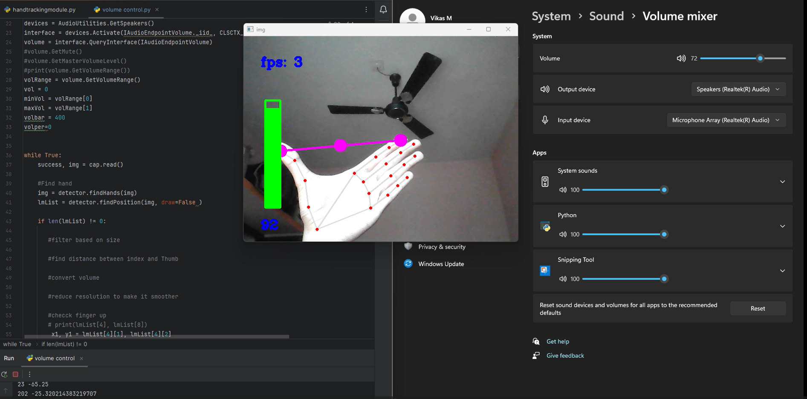

# Hand Tracking for Volume Control



## Project Overview

This repository contains the code and resources for a Hand Tracking Module that allows you to control the volume of your device using hand gestures. The project leverages OpenCV, Python, and the Mediapipe library to track hand movements and interpret gestures.

## How It Works

The Hand Tracking Module detects and tracks the position of your hand in real-time using a webcam. By recognizing gestures like a if the thumb  and index is far the volume will be max or more  or thumb and index finger are close or touching the volume will be low or min , this way I can adjust the volume of my device accordingly.

## Features

- Real-time hand tracking using OpenCV and Mediapipe.
- Gesture recognition for volume control.
- Adjust volume up and down with simple hand gestures.
- Easy-to-follow Python code and instructions.

## Getting Started

To get started with this project, follow these steps:

1. Clone this repository to your local machine:

   ```
   git clone https://github.com/your-username/hand-tracking-volume-control.git
   ```

2. Install the required libraries. You can use a virtual environment for this:

   ```
   pip install -r requirements.txt
   ```

3. Run the Python script to launch the Hand Tracking Module:

   ```
   python volume control.py
   ```

4. Start controlling the volume with your hand gestures!

## Dependencies

- Python 3.x
- OpenCV
- Mediapipe
- hand tracking module
- 
All required dependencies are listed in the [requirements.txt](requirements.txt) file.


## Acknowledgments

- This project was inspired by the open-source computer vision and machine learning community.
- Thanks to the creators of OpenCV and Mediapipe for their fantastic tools.

## Connect

If you have any questions or want to collaborate, feel free to reach out:

- LinkedIn: [vikas](www.linkedin.com/in/vikas-m-31617325b)
- Email:vikasm7146@gmail.com

Happy coding and hand gesture volume control! 🖐️🔊🚀
